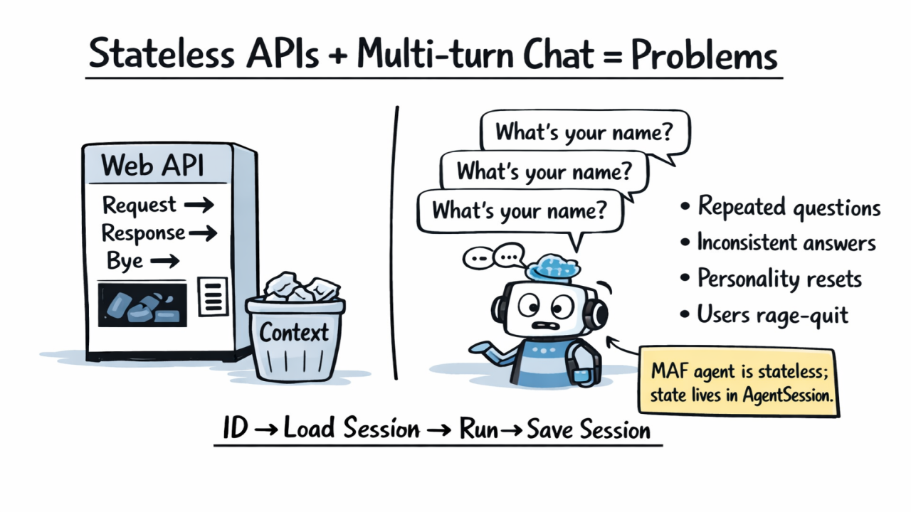
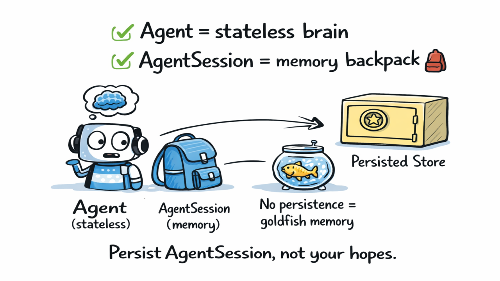
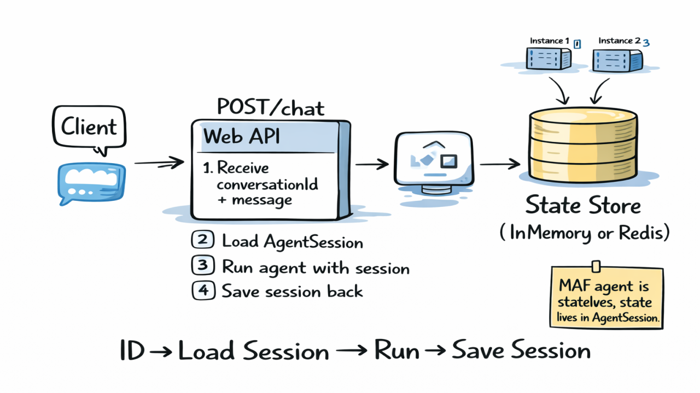

# 🤖 Never Lose Your AI Agent's Train of Thought  

### Persisting Microsoft Agent Framework Sessions with ASP.NET, Redis & Blazor

Have you ever built a chat app where the AI forgets what you said *five seconds ago*? 😅  
That's the classic stateless API problem — and today we're fixing that in .NET using the **Microsoft Agent Framework (MAF)**, **persistent agent sessions**, and a **Blazor frontend** so you can *see memory working live*.

This post is **practical**, **educational**, and a little bit fun — because serious tech doesn't need to be boring. 🚀

---

## 🧠 The Problem: Stateless APIs vs Real Conversations

Classic Web APIs work like this:

**Request → Response → Bye 👋**

That's great for CRUD operations. It's *terrible* for conversations.

Conversational agents are **multi‑turn**. They need context. Without it, you'll see:

- 🔄 Repeated questions  
- 🤷 Inconsistent answers  
- 🧹 Personality resets  
- 😬 Users rage‑quitting your app



In MAF, this happens because **the agent itself is stateless**. The agent is just the brain — it processes requests and generates responses. But without something to *hold* the conversation history between requests, every message starts fresh.

Think of it like talking to someone with amnesia. Every 5 seconds, they forget everything you said. Not a great user experience.

---

## 🎒 The Mental Model: Agent ≠ Memory

This is the most important concept in this post, so let me make it crystal clear:

| Component | What it does | Analogy |
|-----------|--------------|---------|
| 🧠 **Agent** | Stateless brain that processes messages | The thinker |
| 🎒 **AgentSession** | Memory backpack holding conversation history | The backpack |
| 📦 **Persisted Store** | Where memory survives between requests | The safe |

If you don't persist the backpack, your agent has **goldfish memory** 🐟.



> **The key insight**: Persist ``AgentSession``, not your hopes.

MAF fully supports serializing and restoring ``AgentSession``. This is what makes proper multi‑turn conversations possible. The framework handles the conversation tracking *inside* the session — you just need to save and load it between requests.

---

## 🏗️ Architecture Overview

Here's the flow we're building:

1. **Client** sends ``conversationId`` + message  
2. **API** loads ``AgentSession`` from the store (Redis or in‑memory)  
3. **Agent** runs with that session  
4. **Updated session** is saved back to the store  
5. **Response** is returned to the client



This pattern is production-ready because:

- ✅ **Horizontal scaling**: Multiple API instances share state via Redis
- ✅ **Restart resilience**: Sessions survive app restarts
- ✅ **Real traffic**: Clients can hit any instance and get consistent behavior

The magic happens in that simple loop: **Load → Run → Save**. Everything else is just plumbing.

---

## 🛠️ Tech Stack: .NET Aspire + Ollama + Redis

Before we dive into code, here's what orchestrates the whole solution:

```csharp
// AppHost.cs — .NET Aspire orchestration
var builder = DistributedApplication.CreateBuilder(args);

// Redis for session persistence
var cache = builder.AddRedis("cache");

// Ollama for local AI (no cloud required!)
var ollama = builder.AddOllama("ollama").WithDataVolume();
var ollamaModel = ollama.AddModel("chat-model", "llama3.2:1b");

// API with Redis and Ollama references
var api = builder.AddProject<Projects.MafStatefulApi_Api>("api")
    .WithReference(cache).WaitFor(cache)
    .WithReference(ollamaModel).WaitFor(ollamaModel);

// Blazor Web UI
builder.AddProject<Projects.MafStatefulApi_Web>("web")
    .WithReference(api).WaitFor(api);

builder.Build().Run();
```

With Aspire, one ``dotnet run`` spins up Redis, Ollama (with a local LLM), the API, and the Blazor UI. No Docker Compose files. No manual setup. Just run.

---

## 💻 The ASP.NET Core Minimal API

### Request & Response Models

Simple records, nothing fancy:

```csharp
public record ChatRequest
{
    public string? ConversationId { get; init; }
    public required string Message { get; init; }
}

public record ChatResponse
{
    public required string ConversationId { get; init; }
    public required string Answer { get; init; }
}
```

### The ``/chat`` Endpoint

Here's where the session magic lives:

```csharp
group.MapPost("/chat", async (
    ChatRequest request,
    AgentRunner agentRunner,
    ILogger<Program> logger,
    CancellationToken cancellationToken) =>
{
    // Generate a new conversation ID if not provided
    var conversationId = request.ConversationId 
        ?? Guid.NewGuid().ToString();
    
    logger.LogInformation(
        "Chat request received for conversation {ConversationId}",
        conversationId);

    var answer = await agentRunner.RunAsync(
        conversationId,
        request.Message,
        cancellationToken);

    return Results.Ok(new ChatResponse
    {
        ConversationId = conversationId,
        Answer = answer
    });
});
```

Notice how clean this is. The endpoint doesn't deal with sessions directly — that complexity is encapsulated in the ``AgentRunner``. Following the single responsibility principle keeps the endpoint focused on HTTP concerns.

### Bonus Endpoints

The API also includes session management endpoints:

```csharp
// Reset a conversation
group.MapPost("/reset/{conversationId}", async (
    string conversationId,
    IAgentSessionStore sessionStore,
    CancellationToken cancellationToken) =>
{
    await sessionStore.DeleteAsync(conversationId, cancellationToken);
    return Results.Ok(new { message = $"Conversation {conversationId} has been reset." });
});

// List all active sessions
group.MapGet("/sessions", async (
    IAgentSessionStore sessionStore,
    CancellationToken cancellationToken) =>
{
    var sessions = await sessionStore.ListSessionsAsync(cancellationToken);
    return Results.Ok(new { sessions });
});
```

---

## 🧠 The AgentRunner: Where Memory Happens

The ``AgentRunner`` is the orchestrator. It handles the **Load → Run → Save** cycle:

```csharp
public class AgentRunner
{
    private readonly AIAgent _agent;
    private readonly IAgentSessionStore _sessionStore;
    private readonly ILogger<AgentRunner> _logger;

    private static readonly JsonSerializerOptions JsonOptions = JsonSerializerOptions.Web;

    public AgentRunner(
        [FromKeyedServices("AssistantAgent")] AIAgent agent,
        IAgentSessionStore sessionStore,
        ILogger<AgentRunner> logger)
    {
        _agent = agent;
        _sessionStore = sessionStore;
        _logger = logger;
    }

    public async Task<string> RunAsync(
        string conversationId,
        string userMessage,
        CancellationToken cancellationToken = default)
    {
        // 1️⃣ Load or create the session
        var session = await LoadOrCreateSessionAsync(conversationId, cancellationToken);

        // 2️⃣ Run the agent with the message and session
        var response = await _agent.RunAsync(userMessage, session, cancellationToken: cancellationToken);
        var answer = response.Text ?? string.Empty;

        // 3️⃣ Save the updated session
        await SaveSessionAsync(conversationId, session, cancellationToken);

        return answer;
    }
}
```

The ``AgentSession`` object accumulates the conversation history automatically. The agent adds each turn to the session, so by the time we save it, all the context is captured.

### Deserializing Sessions (The Tricky Part)

Loading a session from storage requires deserialization. MAF provides ``DeserializeSessionAsync`` to reconstruct the session from JSON:

```csharp
private async Task<AgentSession> LoadOrCreateSessionAsync(
    string conversationId,
    CancellationToken cancellationToken)
{
    var serializedSession = await _sessionStore.GetAsync(conversationId, cancellationToken);
    
    if (serializedSession is not null)
    {
        try
        {
            var jsonElement = JsonSerializer.Deserialize<JsonElement>(
                serializedSession, JsonOptions);
            return await _agent.DeserializeSessionAsync(
                jsonElement, JsonOptions, cancellationToken);
        }
        catch (Exception ex)
        {
            _logger.LogWarning(ex,
                "Failed to deserialize session for {ConversationId}, creating new",
                conversationId);
        }
    }

    // No existing session — create a fresh one
    return await _agent.GetNewSessionAsync(cancellationToken);
}
```

### Serializing Sessions

Saving is straightforward — MAF sessions serialize to JSON:

```csharp
private async Task SaveSessionAsync(
    string conversationId,
    AgentSession session,
    CancellationToken cancellationToken)
{
    var serializedElement = session.Serialize(JsonOptions);
    var serialized = serializedElement.GetRawText();
    
    await _sessionStore.SetAsync(conversationId, serialized, cancellationToken);
}
```

---

## 🗄️ Session Store Implementations

The ``IAgentSessionStore`` interface abstracts storage, making it easy to swap implementations:

```csharp
public interface IAgentSessionStore
{
    Task<string?> GetAsync(string conversationId, CancellationToken cancellationToken = default);
    Task SetAsync(string conversationId, string serializedThread, CancellationToken cancellationToken = default);
    Task DeleteAsync(string conversationId, CancellationToken cancellationToken = default);
    Task<IEnumerable<string>> ListSessionsAsync(CancellationToken cancellationToken = default);
}
```

### Redis Implementation (Production)

For production, use Redis. It survives restarts, scales horizontally, and is battle-tested:

```csharp
public class RedisAgentSessionStore : IAgentSessionStore
{
    private readonly IDistributedCache _cache;
    private readonly TimeSpan _sessionTtl;

    public async Task<string?> GetAsync(string conversationId, CancellationToken cancellationToken = default)
    {
        var key = $"maf:sessions:{conversationId}";
        return await _cache.GetStringAsync(key, cancellationToken);
    }

    public async Task SetAsync(string conversationId, string serializedThread, CancellationToken cancellationToken = default)
    {
        var key = $"maf:sessions:{conversationId}";
        var options = new DistributedCacheEntryOptions
        {
            SlidingExpiration = _sessionTtl  // Default: 30 minutes
        };
        
        await _cache.SetStringAsync(key, serializedThread, options, cancellationToken);
    }

    public async Task DeleteAsync(string conversationId, CancellationToken cancellationToken = default)
    {
        var key = $"maf:sessions:{conversationId}";
        await _cache.RemoveAsync(key, cancellationToken);
    }
}
```

The sliding expiration is important — sessions expire after 30 minutes of inactivity (configurable via ``SessionTtlMinutes`` in configuration).

### In-Memory Implementation (Development)

For local development or single-instance deployments, the in-memory store works great:

```csharp
public class InMemoryAgentSessionStore : IAgentSessionStore
{
    private readonly IMemoryCache _cache;
    private readonly ConcurrentDictionary<string, bool> _sessionKeys = new();

    public Task<string?> GetAsync(string conversationId, CancellationToken cancellationToken = default)
    {
        var key = $"maf:sessions:{conversationId}";
        _cache.TryGetValue(key, out string? value);
        return Task.FromResult(value);
    }

    public Task SetAsync(string conversationId, string serializedThread, CancellationToken cancellationToken = default)
    {
        var key = $"maf:sessions:{conversationId}";
        _cache.Set(key, serializedThread, new MemoryCacheEntryOptions
        {
            SlidingExpiration = _sessionTtl
        });
        _sessionKeys.TryAdd(conversationId, true);  // Track for listing
        return Task.CompletedTask;
    }
}
```

---

## 🖥️ The Blazor Web UI: See Memory in Action

Documentation is one thing. *Seeing* it work is another.

The repo includes a **Blazor Server UI** that demonstrates session persistence in real-time. No abstract explanations — just chat, refresh the page, and continue where you left off.

### Key Features

- **Session Selector**: Dropdown to switch between active conversations
- **Real-time Chat**: Interactive message interface with typing indicators
- **Session Management**: Create, switch, and reset conversations
- **Visual Feedback**: See the conversation ID stay consistent across page reloads

### The Chat Service

The Blazor app communicates with the API through a simple service:

```csharp
public class ChatApiService
{
    private readonly IHttpClientFactory _httpClientFactory;

    public async Task<ChatResponse?> SendMessageAsync(
        string message, 
        string? conversationId = null)
    {
        var client = _httpClientFactory.CreateClient("api");
        var request = new ChatRequest
        {
            Message = message,
            ConversationId = conversationId
        };

        var response = await client.PostAsJsonAsync("/chat", request);
        response.EnsureSuccessStatusCode();

        return await response.Content.ReadFromJsonAsync<ChatResponse>();
    }

    public async Task<bool> ResetSessionAsync(string conversationId)
    {
        var client = _httpClientFactory.CreateClient("api");
        var response = await client.PostAsync($"/reset/{conversationId}", null);
        return response.IsSuccessStatusCode;
    }
}
```

### The Chat Component

Here's a simplified view of the Blazor chat interface:

```razor
@page "/chat"
@inject ChatApiService ChatApi
@rendermode InteractiveServer

<div class="chat-container">
    <div class="session-controls">
        <select @bind="selectedSessionId" @bind:after="OnSessionChanged">
            <option value="">New Conversation</option>
            @foreach (var session in sessions)
            {
                <option value="@session">@session</option>
            }
        </select>
        <button @onclick="ResetSessionAsync">🗑️ Reset</button>
    </div>

    <div class="chat-messages">
        @foreach (var msg in messages)
        {
            <div class="message @msg.Role">
                <span>@(msg.Role == "user" ? "👤" : "🤖")</span>
                <span>@msg.Text</span>
            </div>
        }
    </div>

    <textarea @bind="userMessage" placeholder="Type your message..."></textarea>
    <button @onclick="SendMessageAsync">Send 📨</button>
</div>

@code {
    private List<ChatMessage> messages = new();
    private string selectedSessionId = "";
    private string userMessage = "";

    private async Task SendMessageAsync()
    {
        messages.Add(new ChatMessage { Role = "user", Text = userMessage });
        
        var response = await ChatApi.SendMessageAsync(
            userMessage,
            string.IsNullOrEmpty(selectedSessionId) ? null : selectedSessionId);

        if (response != null)
        {
            selectedSessionId = response.ConversationId;  // Capture the session ID
            messages.Add(new ChatMessage { Role = "assistant", Text = response.Answer });
        }
        
        userMessage = "";
    }
}
```

The beauty is in the simplicity. The session ID flows through naturally — the Blazor app doesn't need to manage complex state synchronization because that's Redis's job.

---

## ▶️ Run It Yourself

Ready to try it?

```bash
# Clone the repo
git clone https://github.com/elbruno/maf-agent-sessions-persistence-dotnet
cd maf-agent-sessions-persistence-dotnet

# Run with Aspire (starts Redis, Ollama, API, and Web UI)
dotnet run --project src/MafStatefulApi.AppHost
```

This spins up:

- **Redis** for session storage
- **Ollama** with a local LLM (llama3.2:1b by default)
- **API** at port 5256
- **Blazor Web UI** accessible from the Aspire dashboard

### Test with cURL

```bash
# Start a conversation
curl -X POST http://localhost:5256/chat \
  -H "Content-Type: application/json" \
  -d '{"message": "Hello! My name is Bruno."}'

# Response: {"conversationId":"abc123...","answer":"Hello Bruno! ..."}

# Continue the same conversation
curl -X POST http://localhost:5256/chat \
  -H "Content-Type: application/json" \
  -d '{"conversationId": "abc123...", "message": "What is my name?"}'

# Response: {"conversationId":"abc123...","answer":"Your name is Bruno!"}
```

That second request proves memory is working. The agent remembered the name because the session persisted.

---

## 🚀 Why This Matters

Persisting ``AgentSession`` isn't just a nice-to-have — it's essential for any production AI application:

| Without Persistence | With Persistence |
|---------------------|------------------|
| Agent forgets everything | Agent maintains context |
| Users repeat themselves | Conversations flow naturally |
| Single instance only | Horizontally scalable |
| Restart = lost state | Restart = no problem |
| Demo quality | Production quality |

Your AI stops acting like a goldfish and starts acting like… well, an actual assistant.

---

## 📚 Resources

- **Repository**: [github.com/elbruno/maf-agent-sessions-persistence-dotnet](https://github.com/elbruno/maf-agent-sessions-persistence-dotnet)
- **Microsoft Agent Framework**: [learn.microsoft.com/agent-framework](https://learn.microsoft.com/agent-framework/)
- **.NET Aspire**: [learn.microsoft.com/dotnet/aspire](https://learn.microsoft.com/dotnet/aspire/)
- **Ollama**: [ollama.ai](https://ollama.ai/)

🎬 **Video walkthrough coming soon!** Subscribe to [youtube.com/elbruno](https://youtube.com/elbruno) to catch it when it drops.

---

## Wrapping Up

Building production-ready AI agents isn't about the model — it's about the *plumbing*. Session persistence is that plumbing.

The pattern is simple:

1. **Load** the session from storage  
2. **Run** the agent with context  
3. **Save** the updated session  

MAF makes this straightforward with built-in serialization. Redis makes it scalable. Aspire makes it operationally simple.

Give your agents a memory. Your users will thank you.

Happy coding! 🚀  
**— Bruno**
